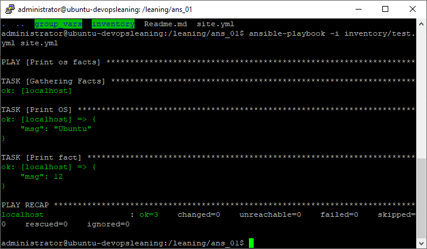
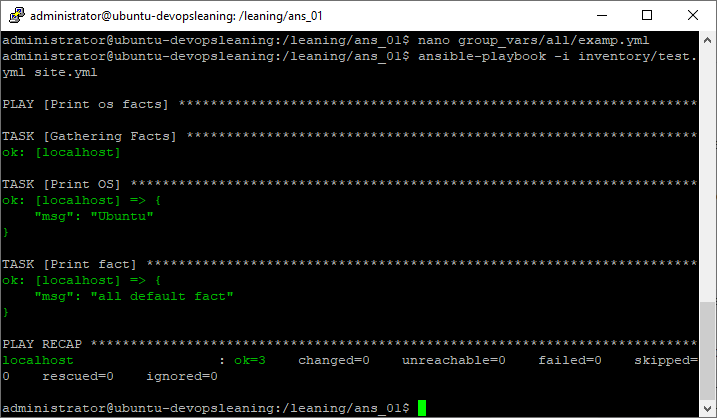
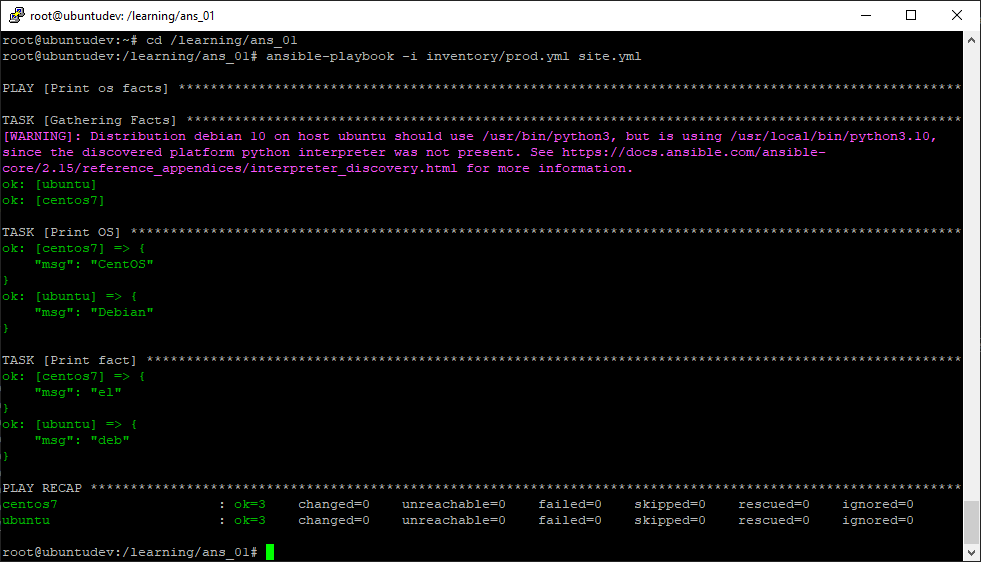
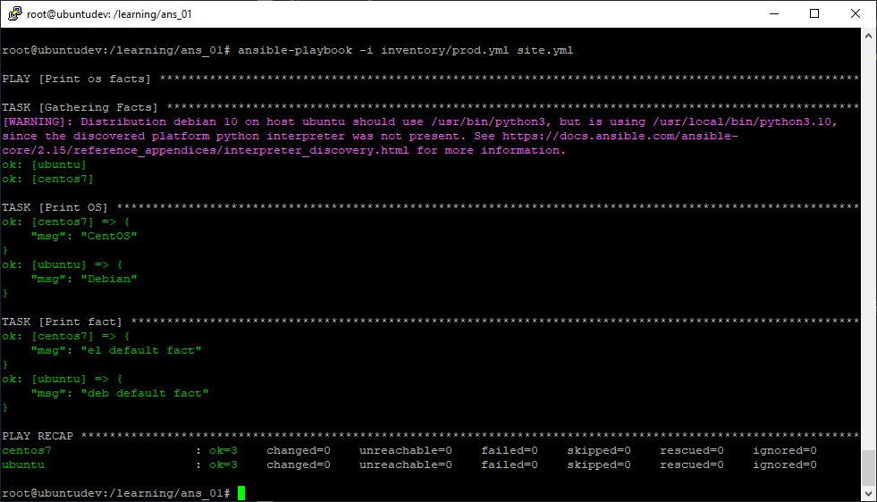
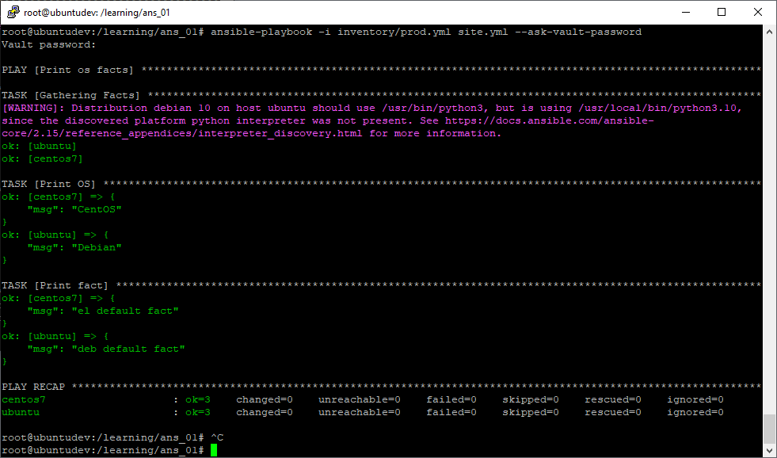
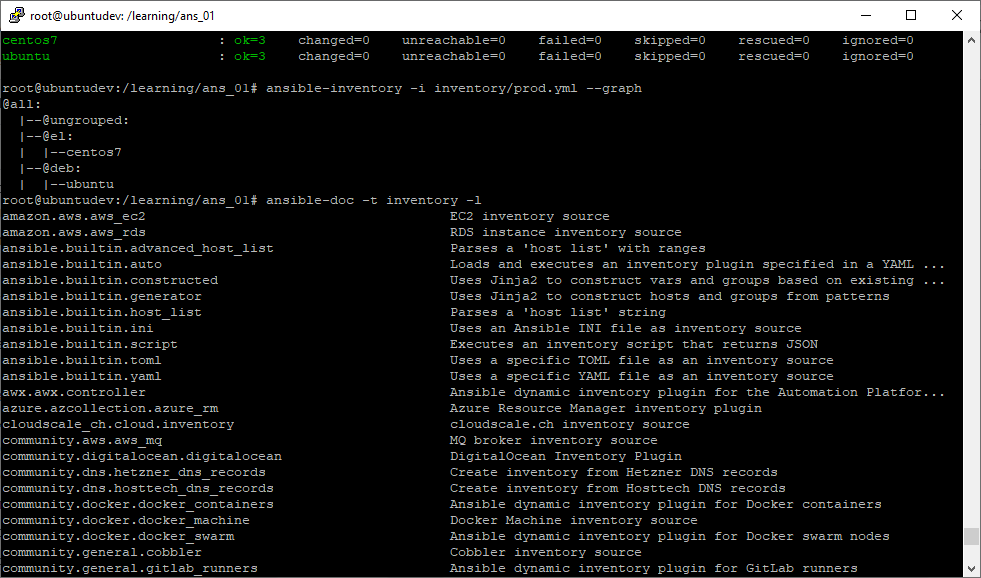
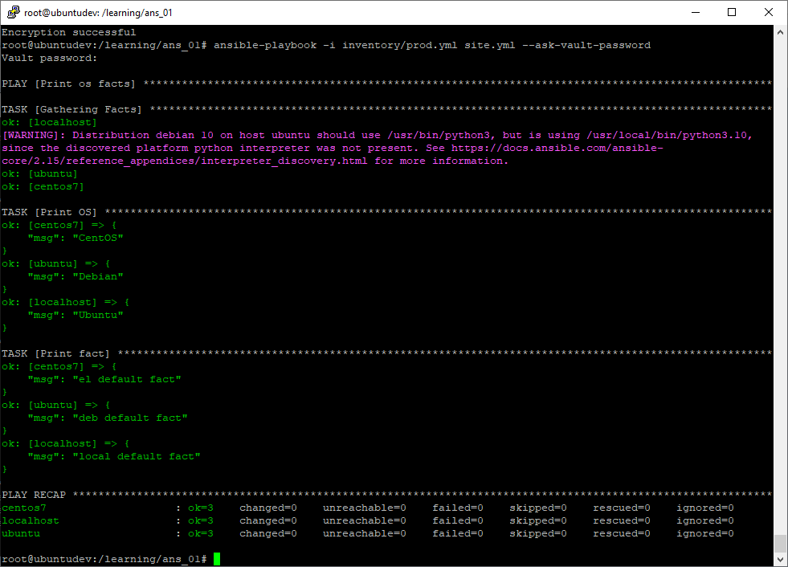

## Основная часть

1. Попробуйте запустить playbook на окружении из `test.yml`, зафиксируйте значение, которое имеет факт `some_fact` для указанного хоста при выполнении playbook.
2. Найдите файл с переменными (group_vars), в котором задаётся найденное в первом пункте значение, и поменяйте его на `all default fact`.
3. Воспользуйтесь подготовленным (используется `docker`) или создайте собственное окружение для проведения дальнейших испытаний.
4. Проведите запуск playbook на окружении из `prod.yml`. Зафиксируйте полученные значения `some_fact` для каждого из `managed host`.
5. Добавьте факты в `group_vars` каждой из групп хостов так, чтобы для `some_fact` получились значения: для `deb` — `deb default fact`, для `el` — `el default fact`.
6.  Повторите запуск playbook на окружении `prod.yml`. Убедитесь, что выдаются корректные значения для всех хостов.
7. При помощи `ansible-vault` зашифруйте факты в `group_vars/deb` и `group_vars/el` с паролем `netology`.
8. Запустите playbook на окружении `prod.yml`. При запуске `ansible` должен запросить у вас пароль. Убедитесь в работоспособности.
9. Посмотрите при помощи `ansible-doc` список плагинов для подключения. Выберите подходящий для работы на `control node`.
10. В `prod.yml` добавьте новую группу хостов с именем  `local`, в ней разместите localhost с необходимым типом подключения.
11. Запустите playbook на окружении `prod.yml`. При запуске `ansible` должен запросить у вас пароль. Убедитесь, что факты `some_fact` для каждого из хостов определены из верных `group_vars`.
12. Заполните `README.md` ответами на вопросы. Сделайте `git push` в ветку `master`. В ответе отправьте ссылку на ваш открытый репозиторий с изменённым `playbook` и заполненным `README.md`.

## Решение

1. Применяем команду **ansible-playbook -i inventory/test.yml site.yml**. На выходе имеем: 
2. После изменения факта в файле **group_vars/all/examp.yml** вывод следующий: 
3. Настройка и запуск двух машин в docker:
   - Инсталляция docker-ce: **apt install docker-ce** 
   - Запуск  машины ubuntu: **docker start ubuntu**
   - Запуск  машины centos7: **docker start centos7**
4. Результат выполнения плайбука на prod inventory: 
5. В папках **group_vars/deb** для группы хостов deb и в папке **group_vars/el** корректируем файлы examp.yml, содержащие факты. 

6. В результате выполнения плайбука получаем: 
7. Шифруем файлы при помощи команды **ansible-vault encrypt group_vars/deb/examp.yml group_vars/el/examp.yml**
8. Выполняем плайбук с ключом **--ask-vault-password**: 
9.  Командой **ansible-doc -t inventory -l** выводим список всех inventory-плагинов. Командой **ansible-doc -t inventory ansible.builtin.yaml** выводим описание плагина ansible.builtin.yaml, встроенного в ansible, начиная с версии 2.4: 
10. Шифруем дополнительный файл group_vars из папки group_vars/local командой **ansible-vault encrypt group_vars/local/examp.yml**
11. После запуска плайбука с указанием пароля получаем вывод: